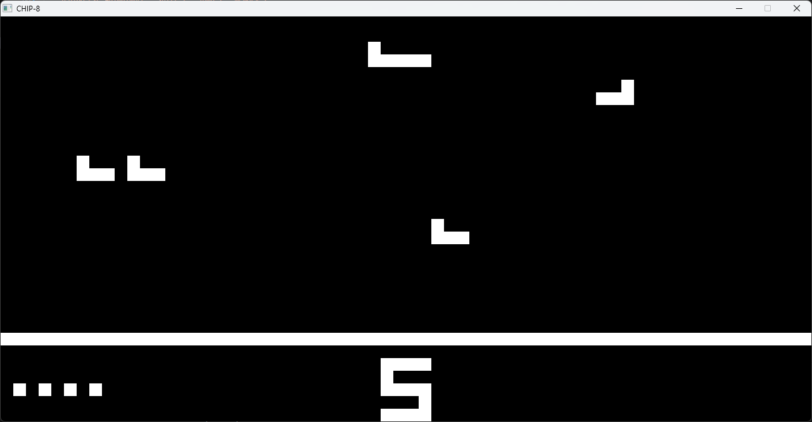
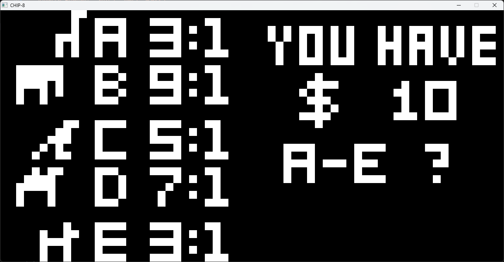
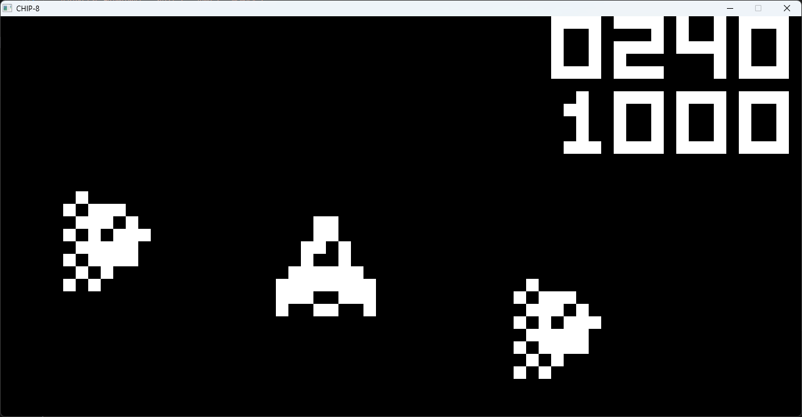
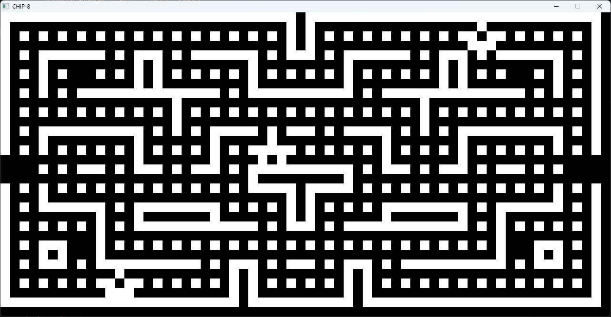
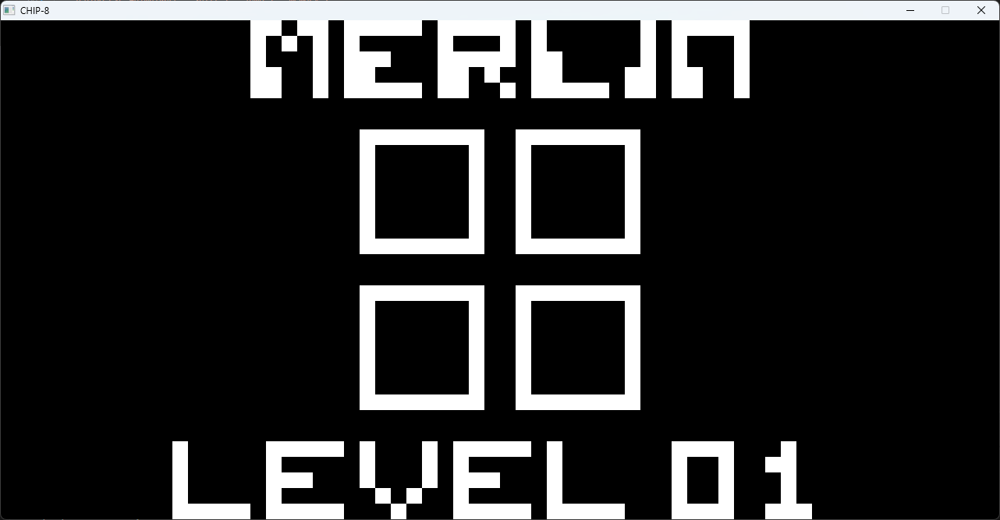
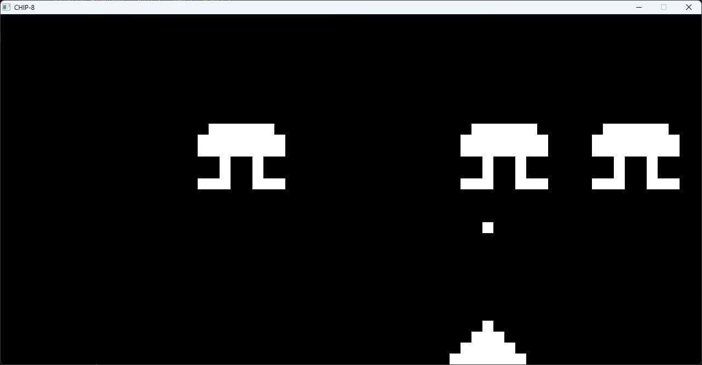

# Chip8 Interpreter

Compact Hexadecimal Interpretive Programming - 8 bit.

## Implementation Details

1. Memory: 4kB RAM
2. Display: 64x32 pixels, monochrome
3. Program Counter
4. Index Register
5. Stack
6. Delay Timer
7. Sound Timer
8. General Registers: V0-VF, 8-bit

## Specs

1. CPU: 800Hz
2. FPS: 60
3. Timers: 60Hz

## GAMES

### Keypad Controls

The following is a mapping of the QWERTY Keyboard to the Chip8 Keypad:

#### QWERTY Keyboard

```
1 2 3 4
Q W E R
A S D F
Z X C V
```

#### Chip8 Keypad

```
 1 2 3 C
 4 5 6 D
 7 8 9 E
 A 0 B F
```

### Included Games

- Airplane
  - **Chip8** Controls:
    > 8 - drop cargo  
    > 
- AnimalRace
  - **Chip8** Controls:
    > A, B, C, D, E, F - select animal  
    > 0-9 - wager $ amount  
    > 
- AstroDodge
  - **Chip8** Controls:
    > 5 - start  
    > 4, 6 - left and right  
    > 2, 8 - up and down  
    > 

- Blinky
  - **Chip8** Controls:
    > 4, 6 - left and right  
    > 2, 8 - up and down  
    > 

- Merlin
  - **Chip8** Controls:
    > 4, 5 - top left, top right quadrants  
    > 7, 8 - bottom left, bottom right quadrants  
    > 

- SpaceInvaders
  - **Chip8** Controls:
    > 5 - start, or shoot  
    > 4, 6 - left and right  
    > 

### How to Load a Game

- ROMS are included in the directory "ROMS/".
- If you want to add a new ROM to play, place the ROM into the "ROMS/" directory.
- Example: loading Space Invaders into the Chip8 interpeter.  
  `.\Chip8.exe SpaceInvaders`

**IMPORTANT**  
Some ROMS require different implementation for some opcodes, or else the ROM may not play correctly.  
Specifically, 0x8006 (shift left) & 0x800E (shift right), BNNN (jump), 0xF055(store memory) & 0xF065 (load memory). Each opcode has 2 different implementations.

Flags are included to change implementation details for these opcodes (either 1 or 2).

- Example: loading AnimalRace into the Chip8 interpreter using different configurations.  
  `.\Chip8.exe AnimalRace --shift 1 --jump 1 --memory 1`  
  `.\Chip8.exe AnimalRace --shift 2 --jump 1 --memory 2`  
  `.\Chip8.exe AnimalRace --shift 2 --jump 2 --memory 2`

## Dependencies

- SDL3 - used for display and keyboard inputs. Ensure the SDL3.dll is located in the same directory as the executable before running.

## Directory

```
chip8/
|--SDL3/
|
|--ROMS/
|    |-----Airplane.ch8
|    |-----AnimalRace.ch8
|    |-----AstroDodge.ch8
|    |-----Blinky.ch8
|    |-----Merlin.ch8
|    |-----SpaceInvaders.ch8
|
|--Chip8.exe
|--SDL3.dll
|--*.cpp
|--*.h
```

## How to Compile
